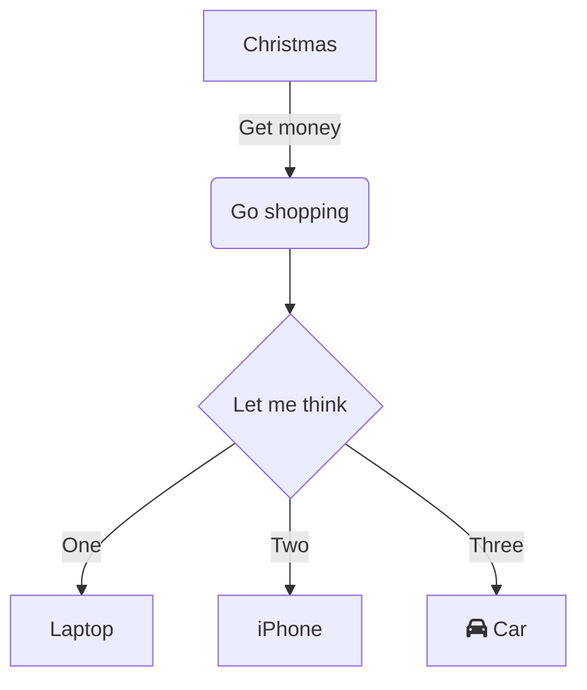

# Getting Started

## New subtitle

Please check the documentation issues for more information: https://github.com/unaizorrilla-githubschool/AccionaNonDevelopers/labels/documentation
https://github.com

[text](https://github.com)

this is a referernce to [Getting Started](#Getting-Started)

this is the [code][https://github.com/unaizorrilla-githubschool/AccionaNonDevelopers/blob/main/README.md](https://github.com/unaizorrilla-githubschool/AccionaNonDevelopers/blob/main/README.md#-prerequisites)

This is a image

Please check the note[^1] for a reference, please press <kbd>CTRL</kbd> for more options

[^1]: this is the reference

